# Codpet - Interactive Pixel Companions / 像素桌面伴侣

[English](#english) | [简体中文](#简体中文)

---

<a name="english"></a>
## English Description

**Codpet** (formerly Codex Pets) is a curated collection of beautiful animated pixel companions designed to live in your editor or developer environment.

This repository serves as:
- **Asset Storage**: Every pet is neatly organized in its own folder containing its runtime metadata (`pet.json`) and spritesheet (`spritesheet.webp`).
- **Interactive Showcase**: A high-performance, minimalist static web gallery deployed on GitHub Pages at [https://0xpipilu.github.io/codpet/](https://0xpipilu.github.io/codpet/) (formerly `codex-pets`).

### Live Preview & Showcase

Browse the library online at: **[https://0xpipilu.github.io/codpet/](https://0xpipilu.github.io/codpet/)**
- **Hover to Preview**: Move your mouse over any pet to see its accelerated interactive animations.
- **One-click Download**: Click `Download` on hover to grab a packaged `.zip` containing the pet's complete assets for easy installation.

### Repository Structure

```text
pets/
  <pet-folder>/
    pet.json          # Pet state mapping and metadata
    spritesheet.webp  # Spritesheet image
    base.png          # Static base thumbnail for documentation
index.json            # Generated catalog data in JSON
catalog.js            # Browser-ready catalog payload
index.html            # Ultra-minimalist showcase page
favicon.png           # Premium HD browser tab icon (Blackbird logo)
og-image.png          # High-definition social preview cover art
scripts/
  build_index.py      # Script to rebuild catalog index
  generate_thumbnails.py # Script to generate base thumbnails
  generate_favicon.py # Script to generate the browser tab icon
```

### Updating the Catalog
When you add, remove, or rename pets, rebuild the index using:
```bash
python3 scripts/build_index.py
```

### Generating Base Thumbnails
To update documentation thumbnails for all pets from their spritesheets:
```bash
python3 scripts/generate_thumbnails.py
```

### Generating Favicon
To update the high-definition favicon.png browser tab icon from the Blackbird assets:
```bash
python3 scripts/generate_favicon.py
```

---

<a name="简体中文"></a>
## 简体中文说明

**Codpet**（原名 Codex Pets）是一个专为编辑器和开发环境设计的像素动画宠物精选库。

本仓库主要用途：
- **资源存储**：每只宠物拥有独立目录，包含其运行时元数据 (`pet.json`) 及精灵图 (`spritesheet.webp`)。
- **互动展示页**：部署于 GitHub Pages 的极简、高性能展示画廊，线上地址：[https://0xpipilu.github.io/codpet/](https://0xpipilu.github.io/codpet/)。

### 线上互动预览

在线浏览地址：**[https://0xpipilu.github.io/codpet/](https://0xpipilu.github.io/codpet/)**
- **悬停预览**：将鼠标悬停在任意宠物上，即可加速循环预览其所有状态的动态效果。
- **一键下载**：悬浮时点击 `Download` 即可一键下载包含该宠物完整元数据与精灵图的 `.zip` 压缩包。

### 目录结构

```text
pets/
  <宠物目录>/
    pet.json          # 宠物元数据及动作状态映射
    spritesheet.webp  # 精灵图
    base.png          # 用于文档的静态基础缩略图
index.json            # 自动生成的整站 JSON 索引
catalog.js            # 浏览器直接加载的 JS 索引
index.html            # 超极简的线上画廊单页面
favicon.png           # 高清浏览器页签图标（以黑鸟形象为 Logo）
og-image.png          # 高清社交预览封面大图
scripts/
  build_index.py      # 重建整站索引的 Python 脚本
  generate_thumbnails.py # 从精灵图自动裁剪生成静态缩略图的脚本
  generate_favicon.py # 自动裁剪、居中缩放生成浏览器图标的脚本
```

### 更新索引
当您添加、删除或重命名宠物时，运行以下命令重建索引：
```bash
python3 scripts/build_index.py
```

### 生成基础缩略图
需要更新宠物在 README 文档中的静态缩略图时，运行：
```bash
python3 scripts/generate_thumbnails.py
```

### 生成浏览器图标
需要从黑鸟资源更新高清浏览器页签图标时，运行：
```bash
python3 scripts/generate_favicon.py
```

---

## Pets Gallery / 宠物画廊

Here is a visual list of all the **83** interactive pixel pets available in Codpet:

<table align="center">
  <tr>
    <td align="center" valign="middle" width="160" height="160">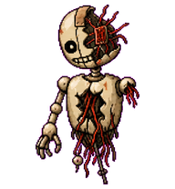</td>
    <td align="center" valign="middle" width="160" height="160">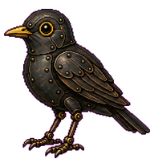</td>
    <td align="center" valign="middle" width="160" height="160">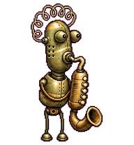</td>
    <td align="center" valign="middle" width="160" height="160"></td>
    <td align="center" valign="middle" width="160" height="160"></td>
    <td align="center" valign="middle" width="160" height="160"></td>
  </tr>
  <tr>
    <td align="center" valign="middle" width="160" height="160">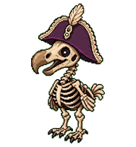</td>
    <td align="center" valign="middle" width="160" height="160">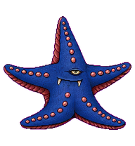</td>
    <td align="center" valign="middle" width="160" height="160">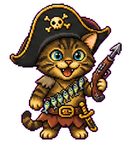</td>
    <td align="center" valign="middle" width="160" height="160">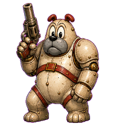</td>
    <td align="center" valign="middle" width="160" height="160">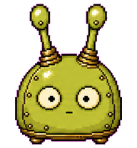</td>
    <td align="center" valign="middle" width="160" height="160">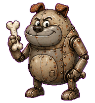</td>
  </tr>
  <tr>
    <td align="center" valign="middle" width="160" height="160">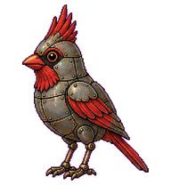</td>
    <td align="center" valign="middle" width="160" height="160">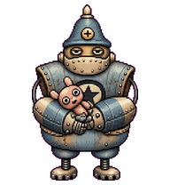</td>
    <td align="center" valign="middle" width="160" height="160"></td>
    <td align="center" valign="middle" width="160" height="160"></td>
    <td align="center" valign="middle" width="160" height="160">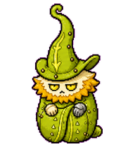</td>
    <td align="center" valign="middle" width="160" height="160">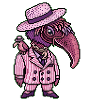</td>
  </tr>
  <tr>
    <td align="center" valign="middle" width="160" height="160">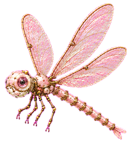</td>
    <td align="center" valign="middle" width="160" height="160"></td>
    <td align="center" valign="middle" width="160" height="160">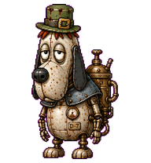</td>
    <td align="center" valign="middle" width="160" height="160">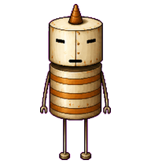</td>
    <td align="center" valign="middle" width="160" height="160">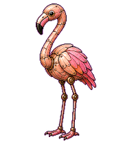</td>
    <td align="center" valign="middle" width="160" height="160">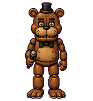</td>
  </tr>
  <tr>
    <td align="center" valign="middle" width="160" height="160">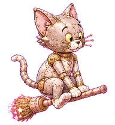</td>
    <td align="center" valign="middle" width="160" height="160">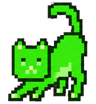</td>
    <td align="center" valign="middle" width="160" height="160">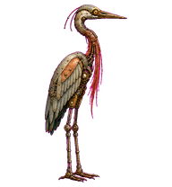</td>
    <td align="center" valign="middle" width="160" height="160">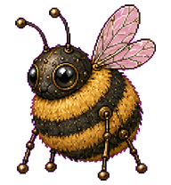</td>
    <td align="center" valign="middle" width="160" height="160"></td>
    <td align="center" valign="middle" width="160" height="160">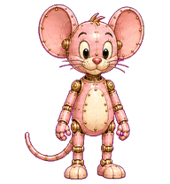</td>
  </tr>
  <tr>
    <td align="center" valign="middle" width="160" height="160"></td>
    <td align="center" valign="middle" width="160" height="160">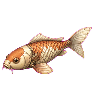</td>
    <td align="center" valign="middle" width="160" height="160">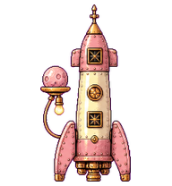</td>
    <td align="center" valign="middle" width="160" height="160">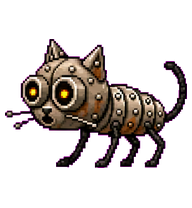</td>
    <td align="center" valign="middle" width="160" height="160">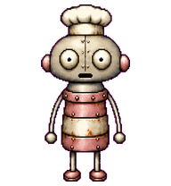</td>
    <td align="center" valign="middle" width="160" height="160">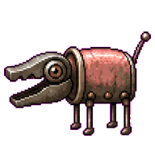</td>
  </tr>
  <tr>
    <td align="center" valign="middle" width="160" height="160">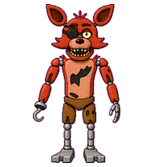</td>
    <td align="center" valign="middle" width="160" height="160"></td>
    <td align="center" valign="middle" width="160" height="160">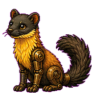</td>
    <td align="center" valign="middle" width="160" height="160"></td>
    <td align="center" valign="middle" width="160" height="160">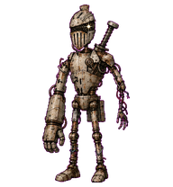</td>
    <td align="center" valign="middle" width="160" height="160">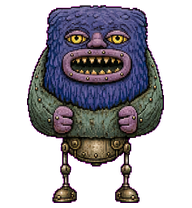</td>
  </tr>
  <tr>
    <td align="center" valign="middle" width="160" height="160">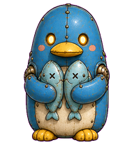</td>
    <td align="center" valign="middle" width="160" height="160">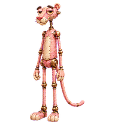</td>
    <td align="center" valign="middle" width="160" height="160">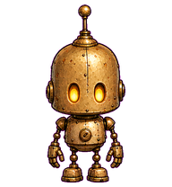</td>
    <td align="center" valign="middle" width="160" height="160">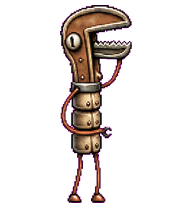</td>
    <td align="center" valign="middle" width="160" height="160">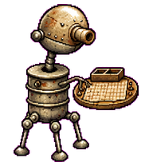</td>
    <td align="center" valign="middle" width="160" height="160">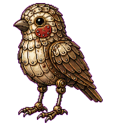</td>
  </tr>
  <tr>
    <td align="center" valign="middle" width="160" height="160"></td>
    <td align="center" valign="middle" width="160" height="160">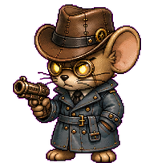</td>
    <td align="center" valign="middle" width="160" height="160">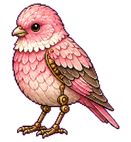</td>
    <td align="center" valign="middle" width="160" height="160"></td>
    <td align="center" valign="middle" width="160" height="160">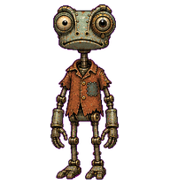</td>
    <td align="center" valign="middle" width="160" height="160"></td>
  </tr>
  <tr>
    <td align="center" valign="middle" width="160" height="160"></td>
    <td align="center" valign="middle" width="160" height="160">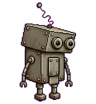</td>
    <td align="center" valign="middle" width="160" height="160"></td>
    <td align="center" valign="middle" width="160" height="160"></td>
    <td align="center" valign="middle" width="160" height="160">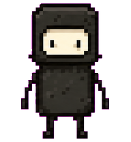</td>
    <td align="center" valign="middle" width="160" height="160">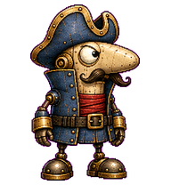</td>
  </tr>
  <tr>
    <td align="center" valign="middle" width="160" height="160">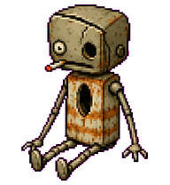</td>
    <td align="center" valign="middle" width="160" height="160">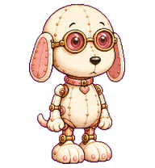</td>
    <td align="center" valign="middle" width="160" height="160">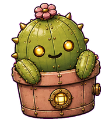</td>
    <td align="center" valign="middle" width="160" height="160">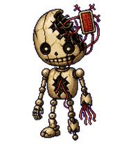</td>
    <td align="center" valign="middle" width="160" height="160">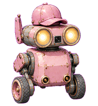</td>
    <td align="center" valign="middle" width="160" height="160">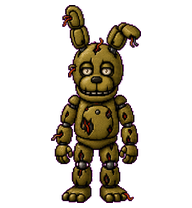</td>
  </tr>
  <tr>
    <td align="center" valign="middle" width="160" height="160"></td>
    <td align="center" valign="middle" width="160" height="160"></td>
    <td align="center" valign="middle" width="160" height="160"></td>
    <td align="center" valign="middle" width="160" height="160"></td>
    <td align="center" valign="middle" width="160" height="160"></td>
    <td align="center" valign="middle" width="160" height="160"></td>
  </tr>
  <tr>
    <td align="center" valign="middle" width="160" height="160"></td>
    <td align="center" valign="middle" width="160" height="160"></td>
    <td align="center" valign="middle" width="160" height="160"></td>
    <td align="center" valign="middle" width="160" height="160"></td>
    <td align="center" valign="middle" width="160" height="160"></td>
    <td align="center" valign="middle" width="160" height="160"></td>
  </tr>
  <tr>
    <td align="center" valign="middle" width="160" height="160"></td>
    <td align="center" valign="middle" width="160" height="160"></td>
    <td align="center" valign="middle" width="160" height="160"></td>
    <td align="center" valign="middle" width="160" height="160"></td>
    <td align="center" valign="middle" width="160" height="160"></td>
    <td align="center" valign="middle" width="160" height="160">&nbsp;</td>
  </tr>
</table>
